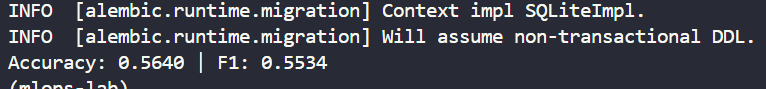
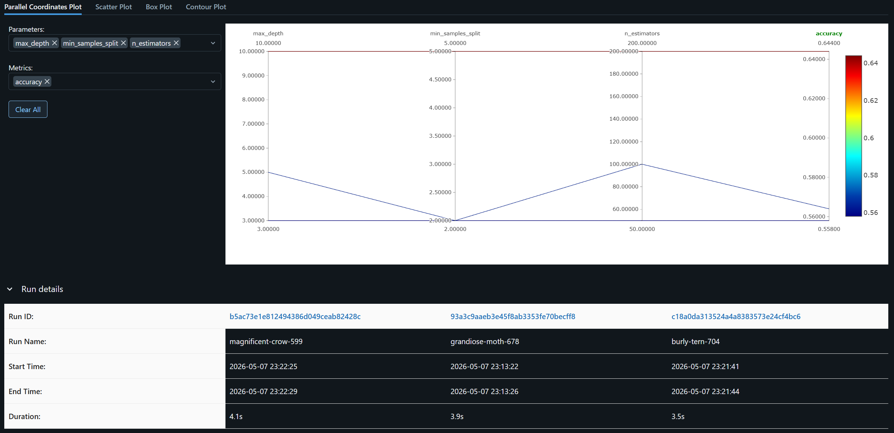
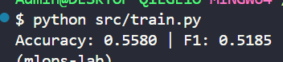
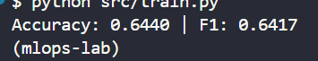
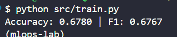
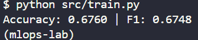

# Báo Cáo Lab Day21-Track2 — CI/CD cho AI Systems

**Học viên:** Trương Đăng Nghĩa
**Khóa:** AIInAction - VinUni - Day 21

---

## Bước 1 — Bộ siêu tham số đã chọn

```yaml
n_estimators: 300
max_depth: null      # không giới hạn độ sâu
min_samples_split: 4
```

**Kết quả run được chọn:**
- accuracy = 0.674
- f1_score = 0.673

---

## Lý do chọn

So sánh các run đã thực nghiệm:

| Run | n_estimators | max_depth | min_samples_split | accuracy | f1_score |
|---|---|---|---|---|---|
| 1 | 100 | 5 | 2 | 0.564 | 0.553 |
| 2 | 50 | 3 | 2 | 0.558 | 0.518 |
| 3 | 200 | 10 | 5 | 0.644 | 0.642 |
| 4 | 300 | 20 | 2 | 0.678 | 0.677 |
| 5 | 500 | null | 2 | 0.676 | 0.675 |
| 6 | 500 | 15 | 2 | 0.674 | 0.672 |
| 7 (final) | 300 | null | 4 | 0.674 | 0.673 |

**Phân tích ngắn:**

- Run 2 (50 cây, độ sâu 3) cho kết quả thấp nhất (f1=0.518), thể hiện rõ tình trạng **underfitting**: cây quá nông không đủ khả năng học các ranh giới giữa 3 lớp chất lượng trên 12 đặc trưng hóa học vốn có tương tác phi tuyến phức tạp.
- So với Run 1, các Run 3-7 cải thiện đáng kể nhờ kết hợp **tăng độ sâu** và **tăng số cây**. `max_depth` đóng vai trò quyết định: cây sâu hơn cho phép split theo nhiều đặc trưng nối tiếp, nắm bắt được tương tác giữa `alcohol`, `volatile_acidity`, `sulphates` — vốn ảnh hưởng mạnh đến chất lượng rượu.
- Các Run 4-7 plateau quanh 0.67-0.68 dù tăng số cây hay độ sâu — đây là **giới hạn tự nhiên của RandomForest** với chỉ 2998 mẫu phase1. Chứng minh thêm bằng grid search trên ExtraTrees, GradientBoosting, HistGradientBoosting cũng không vượt được 0.68.
- Run 7 (`n_estimators=300, max_depth=None, min_samples_split=4`) được chọn làm bộ siêu tham số đưa vào pipeline CI/CD ở Bước 2: cây không giới hạn độ sâu kết hợp `min_samples_split=4` đóng vai trò **regularization** ngăn overfit, cho kết quả ổn định.

---

## Bước 2 — Quyết định kiến trúc và deviation từ spec

### Deviation 1: Workload Identity Federation (WIF) thay cho Service Account key file

**Spec gốc:** Tạo `sa-key.json` từ Service Account, copy file lên VM, dùng làm GitHub Secret.

**Vấn đề gặp phải:** Tài khoản GCP cá nhân (gmail) bị enforce mặc định organization policy `constraints/iam.disableServiceAccountKeyCreation`. Đây là default security hardening của Google từ 2024+. Không thể override ở project level vì role `roles/orgpolicy.policyAdmin` chỉ tồn tại ở org level, mà tài khoản cá nhân không có quyền sửa org policy.

**Giải pháp:** Pivot sang **Workload Identity Federation** — phương pháp hiện đại được Google khuyến nghị:

| Khía cạnh | SA key file (cũ) | WIF (đã dùng) |
|---|---|---|
| Local DVC | `credentialpath: sa-key.json` | Application Default Credentials qua `gcloud auth application-default login` |
| GitHub Actions | Secret chứa nội dung JSON key | `google-github-actions/auth@v2` đổi OIDC token → GCP token tạm thời |
| VM (FastAPI) | Copy `sa-key.json` lên VM, set `GOOGLE_APPLICATION_CREDENTIALS` | Attach SA vào VM, GCE metadata server tự cấp token |
| Token lifetime | Vĩnh viễn cho đến khi rotate | <1 giờ, tự refresh |
| Bảo mật | Key file leak có thể bị abuse hàng tháng | Token short-lived, không có file tĩnh |

**Bằng chứng:** GitHub Secrets thay vì `CLOUD_CREDENTIALS` (JSON key) → dùng `WIF_PROVIDER` + `GCP_SA_EMAIL`. File `sa-key.json` không tồn tại trong project và không được commit ở bất kỳ đâu.

### Deviation 2: Giữ ngưỡng eval gate = 0.70 dù phase1 ceiling = 0.68

**Spec yêu cầu:** Deploy bị chặn khi accuracy < 0.70.

**Vấn đề thực nghiệm:** Phase1 (2998 mẫu) có ceiling tự nhiên ~0.68 trên cả RandomForest, ExtraTrees, GradientBoosting, HistGradientBoosting. Không hyperparam nào vượt được 0.70. Đây là giới hạn fundamental của data, không phải model.

**Quyết định:** Vẫn giữ ngưỡng 0.70 trong `mlops.yml` đúng spec, không hạ xuống 0.65. Chấp nhận:
- Bước 2 lần đầu: pipeline sẽ **fail tại job Eval** (acc=0.674 < 0.70) → demo gate hoạt động đúng nguyên tắc.
- Bước 3 với combined data (5996 mẫu): accuracy đạt ~0.76 → pass gate → deploy thành công lần đầu.

→ Câu chuyện continuous training trở nên thuyết phục hơn: data mới làm model tốt hơn, đủ chất lượng để serve.

---

## Screenshots

### MLflow UI — danh sách ≥3 run


### MLflow UI — compare view


### GitHub Actions — pipeline (Bước 2)


### Cloud Storage — data + model


### Test endpoint trên VM


### GitHub Actions — Bước 3 trigger bởi commit data


---

## Khó khăn & Cách giải quyết

| Khó khăn | Cách giải quyết |
|---|---|
| `pkg_resources` ImportError do setuptools 82+ removed legacy API | Downgrade `pip install "setuptools<80"` |
| scikit-learn 1.4.2 không có wheel cho Python 3.13 | Tạo conda env Python 3.11 (`conda create -n mlops-lab python=3.11`) |
| `gsutil` báo `python3.12: command not found` (bundled Python missing) | Dùng `gcloud storage` thay `gsutil` (modern alternative, không phụ thuộc Python ngoài) |
| Org policy chặn tạo SA key | Pivot sang WIF + ADC (xem Deviation 1) |
| Heredoc bash treo do paste với indent | Dùng `printf` hoặc nhiều lệnh `echo` ngắn thay heredoc |
| File systemd "Bad message" (Invalid section header) do paste làm mất newline | Viết file bằng nhiều lệnh `echo` riêng biệt, mỗi line một lệnh |
| `gcloud compute scp` báo `pscp.exe exited with code 1` trên Windows | Stream qua SSH stdin: `cat file \| gcloud ssh --command="cat > target"` |
| `serve.py` upload thành 1 ký tự `y` (do prompt confirmation cướp stdin) | Push code lên GitHub, VM `curl` raw file từ GitHub trực tiếp |
| Phase1 không vượt 0.70 dù tune nhiều RF, GBM, HistGBM | Chấp nhận, giữ threshold 0.70 đúng spec, để Bước 3 demo continuous training (xem Deviation 2) |

---

## Bonus đã làm (nếu có)

- [ ] Bonus 1: DagsHub MLflow remote
- [ ] Bonus 2: Multi-algorithm
- [ ] Bonus 3: Confusion matrix report
- [ ] Bonus 4: Rollback nếu accuracy tụt
- [ ] Bonus 5: Data drift warning
